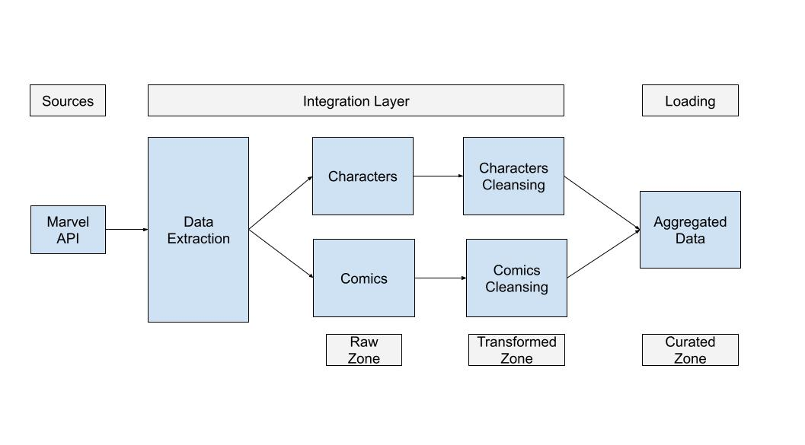

# Marvel API Data Extraction and Aggregation

This Python script interacts with the Marvel API to extract data on characters and comics, cleans the raw data, and performs data aggregation to generate final results.

## Table of Contents

- [Introduction](#introduction)
- [Prerequisites](#prerequisites)
- [Usage](#usage)
- [Directory Structure](#directory-structure)
- [Data Flow](#data-flow)
  - [1. Characters Extraction](#1-characters-extraction)
  - [2. Characters Cleansing](#2-characters-cleansing)
  - [3. Comics Extraction](#3-comics-extraction)
  - [4. Comics Cleansing](#4-comics-cleansing)
  - [5. Data Aggregation](#5-data-aggregation)
- [Logging](#logging)

## Introduction

This script serves as a workflow to interact with the Marvel API, extract information about characters and comics, and perform data cleansing and aggregation. The resulting dataset provides insights into the relationships between Marvel characters and the comics they appear in.

## Prerequisites

Before running the script, make sure you have the following prerequisites:

- Python (3.x recommended)
- Required Python packages (install using `pip install -r requirements.txt`)
- Marvel API public and private keys

## Usage

1. Set your Marvel API public and private keys in the `main` python script.
2. Run the script using `python main.py`.

## Directory Structure

The script organizes data in the following directory structure:

- data/
  - raw/
    - characters/
    - comics/
  - stage/
    - characters/
    - comics/
  - curated/
    - aggregations/
- logging/
  - app.log

## Data Flow

### 1. Characters Extraction

- Calls the Marvel API to retrieve characters.
- Saves raw character data as JSON files in the `data/raw/characters/` directory.

### 2. Characters Cleansing

- Cleans the raw characters data, extracting relevant information.
- Saves cleaned characters data as a CSV file in the `data/stage/characters/` directory.

### 3. Comics Extraction

- Calls the Marvel API to retrieve comics.
- Saves raw comics data as JSON files in the `data/raw/comics/` directory.

### 4. Comics Cleansing

- Cleans the raw comics data, extracting relevant information.
- Saves cleaned comics data as a CSV file in the `data/stage/comics/` directory.

### 5. Data Aggregation

- Combines cleaned characters and comics data based on character IDs.
- Performs data aggregation, counting the number of comics associated with each character.
- Generates final results and saves them as CSV files in the `data/curated/aggregations/` directory.

## Logging

Logs are stored in the `data/logging/app.log` file. The log includes information about script execution, such as progress updates and any encountered errors.

